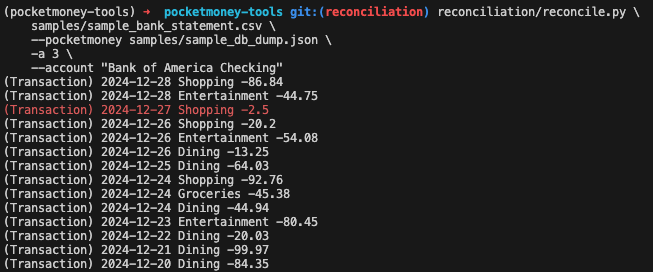

# PocketMoney Tools

Random tools for [PocketMoney](https://apps.apple.com/us/app/pocketmoney/id1281288102) databases

## Dashboards

Pushing transactions to `(OpenSearch|PostgreSQL|?)` and visualizing it with `(OpenSearch Dashboards|Grafana|?)`

### Usage

1. Backup DB to iCloud (or Dropbox or whatever)
1. Run `./refresh_from_icloud.py`
    * This looks for a backup in `~/Library/Mobile\ Documents/iCloud\~com\~pocketmoney\~app/Synchronization/...` 
1. Run `utils/db_loader.py pocketmoney.pmdb`
    * This converts the sqlite DB to JSON

Now choose your stack:
* OpenSearch + OpenSearch Dashboards - [opensearch](opensearch/README.md)
* PostgreSQL + Grafana - [postgres](...)


> To use the demo JSON file:
> * Jump straight into the stack (of your choice) README, no need for any of these steps
> 
> OpenSearch:
> 
> PostgreSQL + Grafana:
> 

## Reconciliation

Reconcile PocketMoney transactions with a CSV statement from other source (eg, *bank*)

Flags allow specifying which columns contain the required info in the CSV

```
$ reconciliation/reconcile.py --help
Usage: reconcile.py [OPTIONS] INPUT

Options:
  --pocketmoney PATH              Path to the converted JSON file  [default:
                                  pocketmoney_db_dump.json]
  --account TEXT                  PocketMoney account name. If not specified,
                                  it will in all accounts
  -f, --date-format TEXT          Date format in CSV  [default: %Y-%m-%d]
  -d, --date-column INTEGER       0-index of the date column  [default: 0]
  -c, --description-column INTEGER
                                  0-index of the description column  [default:
                                  1]
  -a, --amount-column INTEGER     0-index of the amount column  [default: 2]
  --help                          Show this message and exit.
```

